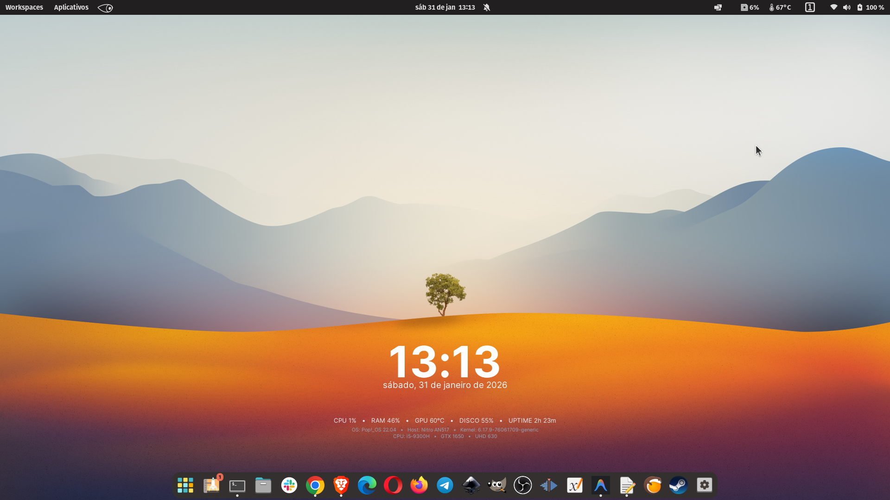

# Modern Minimalist Conky Config

A clean, modern, and high-density Conky configuration designed for warm background gradients, specifically Optimized for Pop!_OS.



## 🌟 Features
- **Modern Aesthetic**: Pure white and slate-grey color palette that blends perfectly with orange/red/purple gradients.
- **High Density**: Compact layout that groups system info into a clean, readable area.
- **System Metrics**: Real-time monitoring of CPU, RAM, GPU (NVIDIA), Disk usage, and Uptime.
- **Hardware Specs**: Dynamic display of OS details, Kernel version, and Hardware models.
- **Autostart Support**: Instructions included to start with your system. [See how here](AUTOSTART.md).

## 🛠️ Installation

### 1. Prerequisites
Install Conky and the Inter font:
```bash
sudo apt update
sudo apt install conky-all fonts-inter
```

### 2. Setup
Clone this repository or download the files, then move the configuration to your conky directory:
```bash
mkdir -p ~/.config/conky
cp conky.conf ~/.config/conky/conky.conf
```

### 3. Run
Launch Conky with the configuration:
```bash
conky -c ~/.config/conky/conky.conf &
```

## 📝 Configuration Details
- **Font**: Inter (Bold for time, Regular for stats)
- **Colors**: 
  - Main: `#FFFFFF` (White)
  - Secondary: `#F8FAFC` (Slate 50)
  - Details: `#E2E8F0` (Slate 200) / `#94A3B8` (Slate 400)
- **Position**: Bottom Middle (Adjusted for high-density visibility)

---
*Created with the help of Antigravity AI.*
